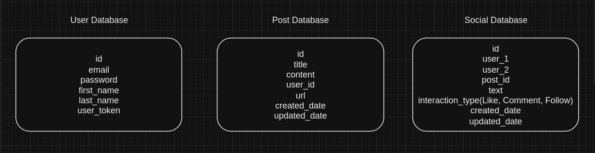

# Pre-requisites

- Docker
- Python 3.8
- PostgreSQL Database. (Add details in the .env and Dockerfile)


# Installation

You can install this project with the following command:

```bash
git clone https://github.com/ananya26-vishnoi/Coffeee.git
```

# Usage


After installing the project you can build a docker image and run it with the following commands:

Post Microservice : 

```bash
cd Post
docker build -t post .
docker run -p 5001:5001 < image-id >
```

Social Microservice : 

```bash
cd Social
docker build -t social .
docker run -p 5002:5002 < image-id >
```

User Microservice : 

```bash
cd User
docker build -t user .
docker run -p 5003:5003 < image-id >
```

All microservices run independently on different ports.

# API Documentation

API documentation is available at https://documenter.getpostman.com/view/17181619/2s9YeHZAmQ

# Database Schema

